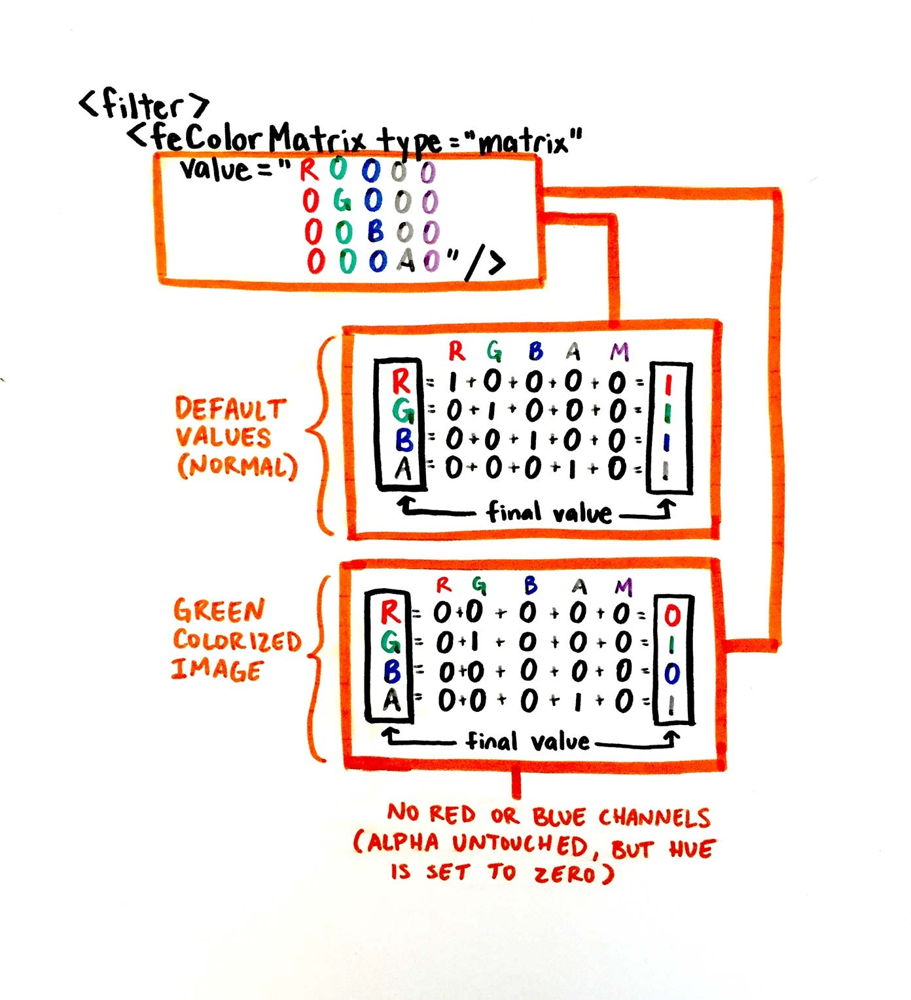

## 简介

文章开始之前，先给出几个研究 css 代码实现图片赋色技术的技术文章。

1. [PNG 格式小图标的 CSS 任意颜色赋色技术 - 张鑫旭](https://www.zhangxinxu.com/wordpress/2016/06/png-icon-change-color-by-css/)
2. [两行 CSS 代码实现图片任意颜色赋色技术 - ChokCoco](http://www.cnblogs.com/coco1s/p/8080211.html)
3. [利用 CSS 改变图片颜色的多种方法 - 前端指南](https://juejin.im/post/5ba21d78f265da0af0337fe3)
4. [SVG 滤镜原来还可以这么用](https://juejin.im/entry/58edb3598d6d81006ca0c72d#comment)

工作中，经常会有这样的场景：

UI 给我切了一张 PNG（jpeg gif ...）


要根据状态变成蓝色

这个时候，你可能会想，那还不简单，于是洋洋洒洒列出几个解决方案

- 使用 unicode 编码 + @font-face
- 使用纯色 svg
- 叫 UI 切两张图（绝大部分是这样做的）

那么是否还有别的，可以利用 css 来对图片进行赋色的技巧呢

## [background-blend-mode 混合模式变色方案](background-blend-mode.html)

技术前提：就是黑色纯色，背景白色：


技术原理：利用 `background-blend-mode` ，我们可以在图片下叠加多一层其他颜色，通过 `background-blend-mode: lighten` 这个混合模式实现改变图片主体颜色黑色为其它颜色的目的。

### 纯色

```css
.pic {
  width: 200px;
  height: 200px;
  background-image: url($img);
  background-size: cover;
}

.pic1 {
  background-image: url($img), linear-gradient(#f00, #f00);
  background-blend-mode: lighten;
  background-size: cover;
}
```

效果如下


### 渐变色

如同上面的例子，实现主色改为渐变色

```css
.pic {
  background-image: url($img), linear-gradient(#f00, #00f);
  background-blend-mode: lighten;
  background-size: cover;
}
```

效果如下：


### 讲解

这里就有必要解释一下 `lighten` 这个混合模式了。变亮，变亮模式与变暗模式产生的效果相反：

1. 用黑色合成图像时无作用，用白色时则仍为白色
2. 黑色比任何颜色都要暗，所以黑色会被任何色替换掉。反之，如果素材的底色是黑色，主色是白色。那就应该用变暗（`darken`）的混合模式

综上，我们确实只需要两行代码就可以实现白色底色黑色主色图片的任意颜色赋色技术。

```css
 {
  background-image: url($img), linear-gradient(#f00, #00f);
  background-blend-mode: lighten;
}
```

其中，background-image 的第二值就是你希望赋值给的渐变色（当然，渐变色可以生成纯色）。

- filter 滤镜
- mask-image
- mask-clip

## [`filter:drop-shadow` 利用投影实现赋色](./drop-shadow.html)

先来看一下 `filter:drop-shadow` 属性的用法

```css
drop-shadow(offset-x offset-y blur-radius spread-radius color)
```

`offset-x`：水平方向偏移量 ，正值表示图像的阴影在图像的 **右方**。

`offset-y`: 垂直方向偏移量，正值代表图像的阴影在图像的 **下方**

`blur-radius`（可选）: 阴影的模糊半径。值越大阴影变得越大和越模糊。如果未指定，则默认为 0，导致锐利，不模糊的边缘。不允许使用负值

`color`（可选的）:阴影的颜色。如果未指定，`color` 则使用该属性的值。

我们拿文章开头的图片做一个例子


```css
.pic {
  filter: drop-shadow(100px 0 0 blue);
}
```

看到这个投影，想必大家都有思路了，如果想实现图片变色的话，需要一个相对定位并且 `overflow:hidden`的父级

```css
.container {
  width: 40px;
  height: 40px;
  position: relative;
  overflow: hidden;
}

.container .pic2 {
  background: url(./user_black.png) no-repeat center;
  width: 40px;
  height: 40px;
  position: absolute;
  left: 0px;
  top: 0px;
  border-left: 40px transparent solid;
  filter: drop-shadow(-40px 0 0 #1296db);
}
```

```html
<div class="container">
  
</div>
```

效果如下


那这个 `border-left: 40px transparent solid;`是什么东西呢

在 Chrome 浏览器下，`drop-shadow` 有一个如下的呈现特性：

> 在 Chrome 浏览器下，如果一个元素的主体部分，无论以何种方式，只要在页面中不可见，其 `drop-shadow` 是不可见的；实体部分哪怕有 1 像素可见，则 `drop-shadow` 完全可见。

所以 `border-left: 40px transparent solid;`是不可少的

## [利用`svg`滤镜进行变色](./filter-url.html)

这个技术要结合`filter: url(resources.svg#c1)`这个属性来使用。

URL 函数接受一个 XML 文件，该文件设置了 一个 SVG 滤镜，且可以包含一个锚点来指定一个具体的滤镜元素.

几个参考链接：

1. [SVG 滤镜创造液态滚动沾粘（Gooey）效果](http://svgtrick.com/tricks/e921a8411f4a6fa9a12374cf3830f5b5)
2. [SVG 滤镜原来还可以这么用](https://juejin.im/entry/58edb3598d6d81006ca0c72d#comment)
3. [SVG 研究之路 (11) - filter:feColorMatrix](https://www.oxxostudio.tw/articles/201406/svg-11-filter-feColorMatrix.html)

我们可以利用 `SVG` 颜色矩阵滤镜（`feColorMatrix`）对图片进行赋色操作

颜色矩阵滤镜，是用一个矩阵的计算，将图片的色彩的每个通道(基于 RGBA)重新计算后输出，便可以达到各种不同的色彩变化效果。

我们知道每一个颜色都是有 R（红）、G（绿）、B（蓝）、A（透明／Alpha）四个颜色通道组成，每一个通道颜色具有 0 到 255 色阶，通过色彩矩阵的换算，可以改变图片里每一个像素的颜色，公式如下：



看不懂？ 没问题


里头的 R in 代表原来的红色色版，R out 代表转换过的红色色版，依此类推 G 和 B 也是如此，最后一个 1 是可以额外增加的参数就先别理他了，因此由公式我们可以知道，经过这个色彩矩阵的转换，我们可以轻松地把一张图片里头的某些颜色换成另外的颜色，或是把某些颜色直接拿掉，直接看下面的范例图比较容易理解：


隐藏红色区域

```css
.pic {
  filter:url(#svgFilter);
}
```


```html
<svg>
  <filter id="svgFilter">
     <feColorMatrix values="0 0 0 0 0
                       0 1 0 0 0
                       0 0 1 0 0
                       0 0 0 1 0" /> 
  </filter>
</svg>


```

效果如下


下面，我们把一个黑色纯色的图标变成 红色

如同下面效果:


更多的效果建议使用工具导出xml 格式的svg滤镜